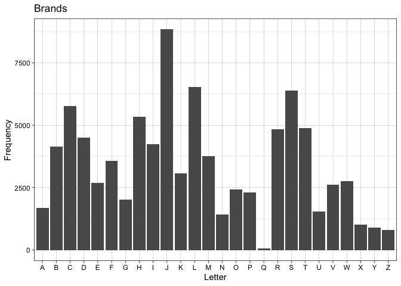

Agent-Based Model of Cattle Brands
================
Mason Youngblood

A detailed description of the structure of the cattle brand data can be
found on the [corresponding
GitHub](https://github.com/masonyoungblood/cattle_brand_data).


## Load and prepare brands data

Before we load our own data, we need to store the brand components.
These include the components listed in the brand book indices, as well
as some additions that appear in the real data (i.e. “1,,” and “TX,”).
The “UN,” component was excluded as it corresponds to unidentifiable
symbols.

``` r
components <- c("#,,", "$,,", "%,,", "(,,", "),,", "*,,", "+,,", "-,,", "-3,",
                "/,,", "1,,", "2,,", "3,,", "4,,", "5,,", "6,,", "7,,", "8,,",
                "9,,", "=,,", "?,,", "A,,", "A1,", "A2,", "A3,", "AH,", "AN,",
                "AP,", "AR,", "AR1", "AR2", "AR3", "AR5", "AR7", "B,,", "BA,",
                "BB,", "BB1", "BB2", "BB3", "BB4", "BB5", "BB6", "BB7", "BE,",
                "BF,", "BI,", "BO,", "BT,", "BU,", "BX,", "BX1", "BX2", "C,,",
                "CA,", "CC,", "CM,", "CO,", "CP,", "CR,", "D,,", "DI,", "E,,",
                "F,,", "F1,", "FB,", "FH,", "FI,", "FL,", "FO,", "G,,", "G2,",
                "G1,", "GU,", "H,,", "H1,", "HA,", "HC,", "HK,", "HR,", "HT,",
                "I,,", "IN,", "J,,", "JA,", "JU,", "JW,", "K,,", "K1,", "KE,",
                "KS,", "L,,", "L1,", "LA,", "LI,", "M,,", "M1,", "MA,", "MI,",
                "MI1", "MI2", "MI3", "MO,", "MU,", "N,,", "N1,", "NT,", "O,,",
                "O1,", "OY,", "P,,", "PI,", "PR,", "Q,,", "QC,", "QC1", "R,,",
                "R1,", "R2,", "RE,", "S,,", "SA,", "SC,", "SD,", "SH,", "SN,",
                "SP,", "SU,", "SK,", "SR,", "SW,", "T,,", "T1,", "TA,", "TK,",
                "TK1", "TK2", "TP,", "TR,", "TR1", "TR2", "TR3", "TU,", "TX,",
                "U,,", "UM,", "V,,", "W,,", "W1,", "WA,", "X,,", "Y,,", "Y1,",
                "Z,,", "[,,", "\\,,", "],,", "^,,", "~,,", "~1,", "~2,", "~3,",
                "~4,", "~5,", "~6,")
```

We also need to generate all possible components, accounting for
rotation, alongside index components in a data frame so rotated versions
can be easily converted to non-rotated versions later on.

``` r
#create empty vectors to fill
all_poss_components <- c()
index_components <- c()

#iterate through components
for(x in 1:length(components)){
  #if a component is rotatable
  if(nchar(gsub(",", "", components[x])) < 3){
    #add rotated versions to all_poss_components
    all_poss_components <- c(all_poss_components, components[x], paste0(substr(components[x], 1, 2), as.character(1:9)))
    
    #repeat the original component the same number of times
    index_components <- c(index_components, components[x], rep(components[x], length(paste0(substr(components[x], 1, 2), as.character(1:9)))))
  }
}

#combine new vectors into a data frame and remove old variable
all_poss_components <- data.frame(index = index_components, rot = all_poss_components)
rm(index_components)
```

Now we can read in and clean up our brand data.

``` r
#read in brand data
brands <- read.csv("brand_data.csv")[, -1]

#remove brands with length of 12 (incorrectly specified according to manual inspection)
brands <- brands[-which(nchar(brands$brand) == 12), ]

#substring brand codes into vector of four components and one location
brands$brand <- lapply(1:nrow(brands), function(x){substring(brands$brand[[x]], first = c(1, 4, 7, 10, 13), last = c(3, 6, 9, 12, 13))})

#print a sample
brands[1:10, ]
```

    ##                    brand location page year
    ## 1  #,,, ,,,, ,,,, ,,,, 1    67563    1 2008
    ## 2  #,,, ,,,, ,,,, ,,1, 1    67835    1 2008
    ## 3  #,,, ,,,, ,,,, ,,1, 3    67880    1 2008
    ## 4  $,,, ,,,, ,,,, ,,1, 1    67104    1 2008
    ## 5  $,,, ,,,, ,,,, ,,1, 3    66428    1 2008
    ## 6  $,,, ,,,, ,,,, ,,1, 5    67869    1 2008
    ## 7  $,,, ,,,, ,,,, ,,1, 6    67664    1 2008
    ## 8  $,,, -,,, ,,,, ,,,, 1    67530    1 2008
    ## 9  $,2, ,,,, ,,,, ,,,, 1    67659    1 2008
    ## 10 %,,, ,,,, ,,,, ,,,, 2    67529    1 2008

Each three digit code corresponds to a component in the brand, and the
final single digit corresponds to the location of the brand on the
animal. Note that the extra commas at the end of each brand component
are just part of the data frame output. Some brands have a single digit
in the 12th digit before the location digit to separate duplicates,
where the same components are arranged in different ways. Let’s extract
those and put them into the sixth position of the brand vectors, and
then remove any misspecified brands with components that don’t appear in
`all_poss_components`.

``` r
#move duplicate code (12th position) into the sixth position of the brand vectors
for(x in 1:nrow(brands)){
  #if fourth position starts with a comma and ends with a number (or O)
  if(substring(brands$brand[[x]][4], 1, 1) == "," & substring(brands$brand[[x]][4], 3) %in% c("O", 0:9)){
    #put duplicate number into the sixth position
    brands$brand[[x]][6] <- gsub(",", "", brands$brand[[x]][4])
    
    #replace any O with 0
    brands$brand[[x]][6] <- gsub("O", 0, brands$brand[[x]][6])
    
    #replace original fourth position with ",,,"
    brands$brand[[x]][4] <- ",,,"
  }
}

#remove all misspecified brands (with components that don't appear in all possible components)
misspecified <- which(sapply(1:nrow(brands), function(x){length(which(brands$brand[[x]][1:4] %in% c(all_poss_components$rot, ",,,")))}) != 4)
brands <- brands[-misspecified,]
rm(misspecified)
```

Before we move any further, we should go ahead and retrieve our
geographic data and subset our brands to only include those registered
in the state of Kansas.

``` r
#get all kansas zip codes and construct all_zips, a data table with zip codes and counties (for now)
data("zip.regions", package = "choroplethrZip")
all_zips <- sort(as.numeric(unique(zip.regions[which(zip.regions$state.name == "kansas"),]$region)))
all_zips <- data.table::data.table(zip = all_zips, county = zip.regions$county.fips.numeric[match(all_zips, zip.regions$region)])

#subset brands to only include those from kansas
brands <- brands[which(brands$location %in% all_zips$zip), ]
```

For our agent-based model (ABM) we will also need the pairwise distances
between all of the zip codes in Kansas, so let’s go ahead and collect
that (and save the object after, because it takes a while).

``` r
#calculate pairwise distances between zip codes
zip_dists <- proxy::dist(all_zips, method = zipcodeR::zip_distance)

#convert to matrix and clean up
zip_dists <- as.matrix(zip_dists)
colnames(zip_dists) <- all_zips
rownames(zip_dists) <- all_zips

#convert from miles to kilometers
zip_dists <- zip_dists*1.609344

#save
save(zip_dists, file = "zip_dists.RData")
```

Now we need to turn our brand data into a numeric matrix so it is
compatible with our ABM. In this matrix, brands will be stored as a
vector of eight numbers, where the first four correspond to the
components (with zeroes for empty component codes) and the last four
correspond to the angles of rotation (with zeroes for unrotated
components). For this, we will just replace each component code with a
node denoting it’s position in the `components` vector, and assign a
zero to empty positions. We will also append zip codes and years.

Once brands are converted let’s go ahead and save the object so we don’t
have to execute all of this code every time.

``` r
#create empty matrix for converted brands
converted_brands <- matrix(0, nrow = nrow(brands), ncol = 10)

#append zip codes and years
converted_brands[, 9] <- as.numeric(brands$location)
converted_brands[, 10] <- as.numeric(brands$year)

#iterate through the brands
for(i in 1:nrow(brands)){
  #extract the index numbers of components (ignoring rotation), and replace empty values with 0
  brand_nums <- match(all_poss_components$index[match(brands$brand[[i]][1:4], all_poss_components$rot)], components)
  brand_nums[is.na(brand_nums)] <- 0
  
  #create empty vector of angles
  angle_nums <- rep(0, 4)
  #iterate through the components
  for(j in 1:length(brand_nums[!is.na(brand_nums)])){
    #check if there are any characters that are different between the actual component and it's index (indicates rotation)
    temp <- as.numeric(setdiff(strsplit(all_poss_components$rot[match(brands$brand[[i]][j], all_poss_components$rot)], split = "")[[1]],
                               strsplit(all_poss_components$index[match(brands$brand[[i]][j], all_poss_components$rot)], split = "")[[1]]))
    
    #if there are, replace the correspond 0 in the vector of angles
    if(length(temp) > 0){angle_nums[j] <- temp}
  }
  
  #store numeric brands and angles in the matrix
  converted_brands[i, 1:4] <- brand_nums
  converted_brands[i, 5:8] <- angle_nums
  
  #remove temporary objects
  rm(list = c("brand_nums", "angle_nums", "temp"))
}

#rewrite brands and remove original brands
brands <- converted_brands
rm(converted_brands)

#save
save(brands, file = "converted_brands.RData")
```

Here’s a sample of what this matrix looks like.

``` r
brands[1:10,]
```

    ##       [,1] [,2] [,3] [,4] [,5] [,6] [,7] [,8]  [,9] [,10]
    ##  [1,]    1    0    0    0    0    0    0    0 67563  2008
    ##  [2,]    1    0    0    0    0    0    0    0 67835  2008
    ##  [3,]    1    0    0    0    0    0    0    0 67880  2008
    ##  [4,]    2    0    0    0    0    0    0    0 67104  2008
    ##  [5,]    2    0    0    0    0    0    0    0 66428  2008
    ##  [6,]    2    0    0    0    0    0    0    0 67869  2008
    ##  [7,]    2    0    0    0    0    0    0    0 67664  2008
    ##  [8,]    2    8    0    0    0    0    0    0 67530  2008
    ##  [9,]    2    0    0    0    2    0    0    0 67659  2008
    ## [10,]    3    0    0    0    0    0    0    0 67529  2008

## Description of the ABM

The agent-based model simulates ranchers creating new brands every year
based on the components (and optionally angles) present in the brands
used by ranchers around them, as well as dual constraints of simplicity
and complexity. For example, with the parameters in the ABM we can run a
model where ranchers copy components at a large geographic scale while
being as different as possible from their closest neighbors, and try to
create brands that are complex enough that they aren’t easily faked but
simple enough that are easily legible.

When a new brand is created, the components and angles around it are
sampled within two radii: one in which components and angles are more
likely to be used (henceforth copying), and one in which components and
angles are less likely to be used (henceforth distinctiveness). All of
the components and angles present in each radii are compiled into
frequency tables that are used for weighted random sampling. The
probability that a rancher uses a particular component (or angle) is
based on the frequency of it within the copying radius, raised to an
exponent *C*, and the inverse frequency of it within the distinctiveness
radius, raised to an exponent *D*.

<!-- $$P(x) = F_x^C \times \left(\frac{1}{F_x}\right)^D$$ -->
<center>

</center>

*C* and *D* control the strength of copying and distinctiveness in the
probability of adopting components and angles, where zero is neutrality,
one is proportional to their observed frequencies, and values greater
than one increase their influence beyond their observed frequencies.

The map below shows an example of copying and distinctiveness radii (200
km and 100 km, respectively) around a target zip code, highlighted in
the darkest blue color. In this example, components and angles within
the larger copying radius would be more likely to be appear in the
target zip code, whereas brands within the smaller distinctiveness
radius would be less likely to be appear. One issue that this map
highlights is that a couple of Kansas zip codes appear to be left out of
the zip code parsing. This issue is moving to the top of the to-do list!



To simulate simplicity and complexity, the number of components in each
new brand is drawn from a Poisson distribution where *λ* is the paramter
of interest (henceforth complexity). Below is an example of the
normalized probabilities of creating a brand with between one and four
components when *λ* is 0.5, 3, and 15.


At the beginning of each year in the ABM a set of `n_new` brands is
created, where `n_new` is the average number of new brands that appear
each year in the observed data. Each new brand is assigned a zip code,
where the probability of each zip code is proportional to its frequency
in all years of the observed data. After new brands are created a set of
`n_old` random brands is removed, where `n_old` is the average number of
brands that disappear each year in the observed data.

The ABM is initialized with the earliest year of observed data and runs
through every year until the final year of observed data. In order to
fit the parameters of the ABM to the observed data we also need to
calculate a set of summary statistics that capture both the overall
diversity and spatial diversity of components and brands. Right now the
ABM collects the following summary statistics at the end of each year:

-   For components:
    -   Overall diversity:
        1.  Proportion of components that are the most common type
        2.  Proportion of components that are the most rare type
        3.  Shannon’s diversity index
        4.  Simpson’s diversity index
    -   Spatial diversity:
        5.  Jaccard index of beta diversity (zip codes)
        6.  Morisita-Horn index of beta diversity (zip codes)
        7.  Jaccard index of beta diversity (counties)
        8.  Morisita-Horn index of beta diversity (counties)
-   For brands:
    -   Overall diversity:
        9.  Proportion of brands that are the most common type
        10. Proportion of brands that are the most rare type
        11. Shannon’s diversity index
        12. Simpson’s diversity index
    -   Spatial diversity:
        13. Jaccard index of beta diversity (zip codes)
        14. Morisita-Horn index of beta diversity (zip codes)
        15. Jaccard index of beta diversity (counties)
        16. Morisita-Horn index of beta diversity (counties)

For all diversity metrics we calculated their Hill number counterparts,
because they are [measured on the same
scale](https://onlinelibrary.wiley.com/doi/10.1111/oik.07202) and
[better account for relative
abundance](https://esajournals.onlinelibrary.wiley.com/doi/abs/10.1890/13-0133.1).
Shannon’s diversity index emphasizes more rare types whereas Simpson’s
diversity index emphasizes more common types. The Jaccard and
Morisita-Horn indices were similarly chosen for their complementarity.
The Morisita-Horn index is a commonly used
[abundance-based](https://onlinelibrary.wiley.com/doi/10.1111/j.1541-0420.2005.00489.x)
beta diversity index, whereas the Jaccard index is the most robust of
the
[incidence-based](https://esajournals.onlinelibrary.wiley.com/doi/10.1002/ecs2.2100)
beta diversity indices to sampling error. We calculated beta diversity
at both the zip code and county-level to assess spatial diversity at two
different resolutions.

The ABM parameters will be fit to the observed data using the random
forest version of approximate Bayesian computation (ABC). Random forest
ABC is [robust to the number of summary
statistics](https://academic.oup.com/bioinformatics/article/32/6/859/1744513)
and even [ranks them according to their
importance](https://academic.oup.com/bioinformatics/article/35/10/1720/5132692),
which means that we will not have to [reduce the
dimensionality](https://projecteuclid.org/journals/statistical-science/volume-28/issue-2/A-Comparative-Review-of-Dimension-Reduction-Methods-in-Approximate-Bayesian/10.1214/12-STS406.full)
of our summary statistics prior to inference.

## Test of the ABM

The ABM functions are in the `cattlebrandABM.R` file. Please refer to
the (heavily commented) functions in this file for details.

``` r
source("cattlebrandABM.R")
```

Before test the ABM we need to calculate a couple of things - First the
probability of rotation, which for now is just the proportion of brands
in the full dataset that are rotated.

``` r
#probability of rotation (proportion of rotated brands in the full dataset)
rot_prob <- as.numeric(1-(table(brands[, 5:8])[1]/sum(table(brands[, 5:8]))))
```

Now we can subset the brand data to (1) calculate the average number of
new and old brands per year, and (2) have the first year of data
separated to initialize the model with.

``` r
#separate brands data by year
brands_2008 <- data.table::data.table(brands[which(brands[, 10] == 2008), 1:9])
brands_2014 <- data.table::data.table(brands[which(brands[, 10] == 2014), 1:9])
brands_2015 <- data.table::data.table(brands[which(brands[, 10] == 2015), 1:9])
brands_2016 <- data.table::data.table(brands[which(brands[, 10] == 2016), 1:9])

#calculate average number of new brands that appear each year and old brands that disappear each year (fsetdiff gets rows of first that are not in second)
n_new <- mean(c((nrow(data.table::fsetdiff(brands_2014, brands_2008))/6),
                nrow(data.table::fsetdiff(brands_2015, brands_2014)),
                nrow(data.table::fsetdiff(brands_2016, brands_2015))))
n_old <- mean(c((nrow(data.table::fsetdiff(brands_2008, brands_2014))/6),
                nrow(data.table::fsetdiff(brands_2014, brands_2015)),
                nrow(data.table::fsetdiff(brands_2015, brands_2016))))
```

We also need to reshape components so it includes whether or not a
component is rotatable (or includes at least one comma).

``` r
#reshape components
components <- data.table::data.table(components = components, rotatable = grepl(",", components))
```

Eventually we can use the code below to set the limits of our prior for
the sizes of the two radii.

``` r
#get min and max distances between zip codes (to inform prior range)
round(min(zip_dists[which(zip_dists != 0)]))
```

    ## [1] 1

``` r
round(max(zip_dists))
```

    ## [1] 688

Okay, now we are ready to do a test run of the ABM. We’ll set the
complexity (*λ*) to 3, the copying radius to 200 km, the distinctive
radius to 100 km, and the strength of both copying and distinctiveness
to 1. The model will be initialized with the data from 2008, and summary
statistics will be collected for 2014, 2015, and 2016. We’ll also run
one model that ignores the angles of components, and one that takes it
into account

``` r
#test out the components-only ABM (and get runtime)
start <- Sys.time()
components_only <- cattlebrandABM(init_brands = as.matrix(brands_2008), components, all_zips, zip_dists,
                                  init_year = 2008, sampling_years = c(2014, 2015, 2016), n_new, n_old,
                                  rot_prob, complexity = 3, copy_radius = 200, copy_strength = 1,
                                  dist_radius = 100, dist_strength = 1, angles = FALSE)
Sys.time() - start
```

    ## Time difference of 1.404144 mins

``` r
#print output
components_only
```

    ##            [,1]         [,2]     [,3]     [,4]      [,5]      [,6]      [,7]
    ## [1,] 0.07060354 0.0005723205 68.32879 42.32907 0.1667664 0.2938594 0.4947186
    ## [2,] 0.06876187 0.0006243984 72.55337 44.51068 0.1728096 0.2994647 0.5178066
    ## [3,] 0.06689198 0.0007799298 76.43395 46.70816 0.1782026 0.3020463 0.5378355
    ##           [,8]        [,9]        [,10]    [,11]    [,12]       [,13]
    ## [1,] 0.7635170 0.003024437 6.048875e-05 4414.890 2603.370 0.001643871
    ## [2,] 0.7614024 0.002973481 6.068329e-05 4622.210 2722.517 0.001544123
    ## [3,] 0.7590734 0.002861317 6.087909e-05 4811.039 2829.420 0.001455316
    ##            [,14]       [,15]      [,16]
    ## [1,] 0.002464474 0.010461031 0.02298364
    ## [2,] 0.002526558 0.009842374 0.02278508
    ## [3,] 0.002555865 0.009286425 0.02189881

``` r
#test out the components and angles ABM (and get runtime)
start <- Sys.time()
components_angles <- cattlebrandABM(init_brands = as.matrix(brands_2008), components, all_zips, zip_dists,
                                    init_year = 2008, sampling_years = c(2014, 2015, 2016), n_new, n_old, 
                                    rot_prob, complexity = 3, copy_radius = 200, copy_strength = 1, 
                                    dist_radius = 100, dist_strength = 1, angles = TRUE)
Sys.time() - start
```

    ## Time difference of 2.634645 mins

``` r
#print output
components_angles
```

    ##            [,1]         [,2]     [,3]     [,4]       [,5]      [,6]      [,7]
    ## [1,] 0.06928966 2.603895e-05 134.0088 64.08295 0.03571139 0.2126536 0.1274880
    ## [2,] 0.06690462 2.605320e-05 142.7693 67.56712 0.03394795 0.2115194 0.1220404
    ## [3,] 0.06457074 2.604709e-05 151.3255 71.39508 0.03319902 0.2103214 0.1201841
    ##           [,8]        [,9]        [,10]    [,11]    [,12]        [,13]
    ## [1,] 0.6995181 0.001149286 6.048875e-05 8122.726 5954.401 0.0007542406
    ## [2,] 0.6917964 0.001152983 6.068329e-05 8286.481 6072.529 0.0007199774
    ## [3,] 0.6874629 0.001156703 6.087909e-05 8463.114 6216.614 0.0006836783
    ##             [,14]       [,15]       [,16]
    ## [1,] 0.0008995754 0.004881742 0.007680596
    ## [2,] 0.0009755317 0.004660413 0.007718895
    ## [3,] 0.0009798987 0.004426268 0.007608850

The output of each model is a matrix with a row for each of the three
sampling years, and a column for each of the 16 summary statistics
collected in that year. Right now the runtime of both models (especially
the angle) is far too high for generative inference, so we will have to
do quite a bit of profiling and optimization to get it down.
