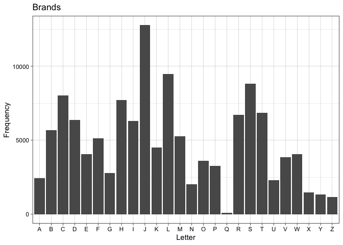

Agent-Based Model of Cattle Brands
================
Mason Youngblood

A detailed description of the structure of the cattle brand data can be
found on the [corresponding
GitHub](https://github.com/masonyoungblood/cattle_brand_data).


## Load and prepare brands data

First let’s read in and clean up our brand data.

``` r
#read in brand data
brands <- read.csv("brand_data.csv")[, -1]

#remove brands with length of 12 (incorrectly specified according to manual inspection)
brands <- brands[-which(nchar(brands$brand) == 12), ]

#substring brand codes into vector of four components and one location
brands$brand <- lapply(1:nrow(brands), function(x){substring(brands$brand[[x]], first = c(1, 4, 7, 10, 13), last = c(3, 6, 9, 12, 13))})

#print a sample
brands[1:10, ]
```

    ##                    brand location page year
    ## 1  #,,, ,,,, ,,,, ,,,, 1    67563    1 2008
    ## 2  #,,, ,,,, ,,,, ,,1, 1    67835    1 2008
    ## 3  #,,, ,,,, ,,,, ,,1, 3    67880    1 2008
    ## 4  $,,, ,,,, ,,,, ,,1, 1    67104    1 2008
    ## 5  $,,, ,,,, ,,,, ,,1, 3    66428    1 2008
    ## 6  $,,, ,,,, ,,,, ,,1, 5    67869    1 2008
    ## 7  $,,, ,,,, ,,,, ,,1, 6    67664    1 2008
    ## 8  $,,, -,,, ,,,, ,,,, 1    67530    1 2008
    ## 9  $,2, ,,,, ,,,, ,,,, 1    67659    1 2008
    ## 10 %,,, ,,,, ,,,, ,,,, 2    67529    1 2008

Each three digit code corresponds to a component in the brand, and the
final single digit corresponds to the location of the brand on the
animal. Note that the extra commas at the end of each brand component
are just part of the data frame output. Some brands have a single digit
in the 12th digit before the location digit to separate duplicates,
where the same components are arranged in different ways. Let’s extract
those and put them into the sixth position of the brand vectors.

``` r
#move duplicate code (12th position) into the sixth position of the brand vectors
for(x in 1:nrow(brands)){
  #if fourth position starts with a comma and ends with a number (or O)
  if(substring(brands$brand[[x]][4], 1, 1) == "," & substring(brands$brand[[x]][4], 3) %in% c("O", 0:9)){
    #put duplicate number into the sixth position
    brands$brand[[x]][6] <- gsub(",", "", brands$brand[[x]][4])
    
    #replace any O with 0
    brands$brand[[x]][6] <- gsub("O", 0, brands$brand[[x]][6])
    
    #replace original fourth position with ",,,"
    brands$brand[[x]][4] <- ",,,"
  }
}

#save
save(brands, file = "raw_brands.RData")
```

Before we move any further we should determine whether letters in
components tend to be initials or whether they should be treated as
distinct. Here are the frequencies of letters in the brands.



If we compare this with the distribution of first letters of surnames
that appeared more than 100 times in the 2010 US Census we can see that
the distributions are drastically different.


``` r
#load in the checked brands with letters and get the proportion correct
prop_correct <- mean(read.csv("letters_checked.csv")$initials)*100
```

Weighting the US surname distribution so that it matches the racial
composition of Kansas does not solve the issue, so we manually checked
200 random brands with letters in the 2016 brand book. In 78% of the
random brands at least one of the letters corresponded to one or both of
the first or last names of the owners or the ranch (with some letters
modifying others, like A and L both appearing in a brand where the L is
a “leg” on the right side of the A in a brand owned by the family
Asmussen, and some characters combined to make a letter, like L and 7
combined into an S for Schneider).

Since a significant number of letters in brands are not initials, some
letters (e.g. I and O) are also used to code shapes, and different
letters have different possible rotation angles, we chose to keep them
as separate categories. Numbers were also included as separate
categories. Some of the symbols in the brand book have variants that are
distinguished using the third digit that is usually used for rotation
(e.g. AR, BB, MI, TK, and TR). We collapsed each set of these symbols
into single categories that can be rotated just like any other
component.

We made some further adjustments to Kansas’ coding scheme by removing
redundant components and restricting the possible angles of rotations
for different symbols. All of these adjustments are stored in
`components.xlsx`: the `collapse` sheet has which components should be
converted to what along with their new angles, and the `rotation` sheet
has which components can be rotated in which directions. For
clarification, the possible rotation angles for each component are the
first unique rotations for that shape. For example, the 1, 3, and 4
rotations for the letter A are all identical (upside down) so 1 is kept
as the first unique rotation. The `rotation` sheet also has a column for
each angle (1 to 9), where the value for each component is whether that
angle is correct if it appears (NA), needs to be corrected to no
rotation (0), or needs to be corrected to a different rotation (1 to 9).

All letter variations were converted to single categories. For example,
A1 and A2, two stylistic variations of A with square and rounded tops,
were both converted to A. The letter I is used primarily for vertical
lines, so the other single line symbols (i.e. /, \\, and -) were
converted to I (with their associated angles). 1, which could be easily
mistaken for I, does not appear in the coding scheme. Double and triple
lines are stored as separate symbols (i.e. = and -3). We chose to keep
these as separate categories rather than convert them to multiple
repetitions of I, as reducing components to their constituent parts
introduces many other issues and could inflate the measured complexity
(or number of components) of some brands.

), QC, and QC1 were all converted to ( (with their associated angles).
\], BX1, and BX2 were all converted to \[ (with their associated
angles). DI (diamond) was converted to BX (box) with the associated
angle. All of the \~ components (i.e. \~1 through \~6), which correspond
to pairs of “squiggles” or “wings” that modify other components, do not
seem to have systematic differences or angles and were combined into a
single category without rotation.

MU, an unused code for music notes, was converted to NT, a code for
notation that appears in the brand books. ^ was converted to A3, a code
used for the same symbol in the brand books.

Several other simplifications were considered (with angles), such as
converting + to X, 9 to 6, W to M, etc. For now we chose to keep these
components separate.

``` r
#load in adjustments from components.xlsx
collapse <- data.table::as.data.table(readxl::read_excel(paste0(dirname(rstudioapi::getSourceEditorContext()$path), "/", "components.xlsx"), sheet = "collapse"))
rotation <- data.table::as.data.table(readxl::read_excel(paste0(dirname(rstudioapi::getSourceEditorContext()$path), "/", "components.xlsx"), sheet = "rotation"))

#reformat rotation
rotation$rot <- strsplit(rotation$rot, ", ")
```

``` r
#for each brand
for(i in 1:nrow(brands)){
  #check if there are characters that need replacing (either three digit characters like BX1 and QC1 or substringed characters without commas)
  temp <- which(brands$brand[[i]][1:4] %in% collapse$from | gsub(",", "", substr(brands$brand[[i]][1:4], 1, 2)) %in% collapse$from)
  
  #and if there are
  if(length(temp) > 0){
    #go through them
    for(j in 1:length(temp)){
      #if the full three-digit component is in the data table (so something like BX1, QC1, etc.)
      if(brands$brand[[i]][temp[j]] %in% collapse$from){
        #store the index of the component
        temp_2 <- which(collapse$from == brands$brand[[i]][temp[j]])
        
        #and either replace it without or with rotation
        if(collapse$rot[temp_2] == "NA"){
          brands$brand[[i]][temp[j]] <- stringr::str_pad(collapse$to[temp_2], width = 3, side = "right", pad = ",")
        } else{
          brands$brand[[i]][temp[j]] <- paste0(stringr::str_pad(collapse$to[temp_2], width = 2, side = "right", pad = ","), collapse$rot[temp_2])
        }
      } else{ #if it's less than three digits
        #store the index of the component
        temp_2 <- which(collapse$from == gsub(",", "", substr(brands$brand[[i]][temp[j]], 1, 2)))
        
        #and either replace it without or with rotation
        if(collapse$rot[temp_2] == "NA"){
          brands$brand[[i]][temp[j]] <- stringr::str_pad(collapse$to[temp_2], width = 3, side = "right", pad = ",")
        } else{
          brands$brand[[i]][temp[j]] <- paste0(stringr::str_pad(collapse$to[temp_2], width = 2, side = "right", pad = ","), collapse$rot[temp_2])
        }
      }
      
      rm(temp_2)
    }
  }
  
  rm(temp)
}
```

To determine which angles are possible for each symbol we went through
and assigned each one a five-digit binary code, where each digit
corresponds to whether (0 or 1) each symbol matches itself when flipped
horizontally, flipped vertically, rotated 90 degrees, rotated 180
degrees, and rotated 45 degrees. Then, for each five-digit code, we
determined which rotation angles were possible. Some extra rotation
angles were manually removed for character pairs like + and X, 9 and 6,
and W and M, and some rotations angles had to be corrected when the
binary code didn’t quite capture the symbol, such as for %.

Now let’s run through and correct any rotated components where the angle
does not match the vector of first unique rotation angles for that
component.

``` r
#for each brand
for(i in 1:nrow(brands)){
  #check if there are rotated components
  temp <- which(substr(brands$brand[[i]][1:4], 3, 3) %in% c(1:9))
  
  #if there are
  if(length(temp) > 0){
    #go through them
    for(j in 1:length(temp)){
      #store the index of the component
      temp_2 <- which(rotation$component == gsub(",", "", substr(brands$brand[[i]][temp[j]], 1, 2)))
      
      #store the current angle of rotation
      angle <- substr(brands$brand[[i]][temp[j]], 3, 3)
      
      #if the rotated component matches a real component (checking since we haven't removed misspecified components yet)
      if(length(temp_2) > 0){
        #and the rotation angle is not in the first unique rotation angles for that component
        if(!(angle %in% rotation$rot[[temp_2]])){
          #and the new rotation is not zero
          if(as.numeric(rotation[temp_2, ..angle]) > 0){
            #replace the current rotated component with a corrected version
            brands$brand[[i]][temp[j]] <- paste0(substr(brands$brand[[i]][temp[j]], 1, 2), as.numeric(rotation[temp_2, ..angle]))
          } else{ #if the new rotation is zero
            #remove the rotation entirely
            brands$brand[[i]][temp[j]] <- paste0(substr(brands$brand[[i]][temp[j]], 1, 2), ",")
          }
          
        }
      }
      
      rm(list = c("temp_2", "angle"))
    }
  }
  
  rm(temp)
}
```

Now we need to store the brand components. These include the components
listed in the brand book indices, as well as some additions that appear
in the real data (i.e. “TX,”). The “UN,” component was excluded as it
corresponds to unidentifiable symbols.

``` r
#store components with commas
components <- stringr::str_pad(rotation$component, width = 3, side = "right", pad = ",")

#print them
components
```

    ##   [1] "A,," "B,," "C,," "D,," "E,," "F,," "G,," "H,," "I,," "J,," "K,," "L,,"
    ##  [13] "M,," "N,," "O,," "P,," "Q,," "R,," "S,," "T,," "U,," "V,," "W,," "X,,"
    ##  [25] "Y,," "Z,," "#,," "$,," "%,," "(,," "[,," "*,," "?,," "+,," "=,," "-3,"
    ##  [37] "~,," "2,," "3,," "4,," "5,," "6,," "7,," "8,," "9,," "A3," "AH," "AN,"
    ##  [49] "AP," "AR," "BA," "BB," "BE," "BF," "BI," "BO," "BT," "BU," "BX," "CA,"
    ##  [61] "CC," "CM," "CO," "CP," "CR," "FB," "FH," "FI," "FL," "FO," "GU," "HA,"
    ##  [73] "HC," "HK," "HR," "HT," "IN," "KS," "LA," "LI," "MA," "MI," "MO," "NT,"
    ##  [85] "O1," "OY," "PI," "PR," "RE," "SA," "SC," "SD," "SH," "SN," "SP," "SU,"
    ##  [97] "SK," "SR," "T1," "TA," "TK," "TP," "TR," "TU," "TX," "UM," "WA,"

We also need to generate all possible components, accounting for
rotation, alongside index components in a data frame so rotated versions
can be easily converted to non-rotated versions later on. Since we have
already corrected incorrect angles we will only allow for angles that
appear in the vector of first unique rotation angles for that component.

``` r
#create empty vectors to fill
all_poss_components <- c()
index_components <- c()

#iterate through components
for(x in 1:length(components)){
  #if the component is not rotatable
  if(length(which(rotation$rot[[x]] == "NA")) > 0){
    #add it without rotation
    all_poss_components <- c(all_poss_components, components[x])
    index_components <- c(index_components, components[x])
  } else{
    #add it with rotation
    all_poss_components <- c(all_poss_components, components[x], paste0(substr(components[x], 1, 2), rotation$rot[[x]]))
    index_components <- c(index_components, components[x], rep(components[x], length(paste0(substr(components[x], 1, 2), rotation$rot[[x]]))))
  }
}

#combine new vectors into a data frame and remove old variable
all_poss_components <- data.frame(index = index_components, rot = all_poss_components)
rm(index_components)
```

Now let’s remove any misspecified brands with components that don’t
appear in `all_poss_components`.

``` r
#remove all misspecified brands (with components that aren't letters or don't appear in all possible components)
misspecified <- which(sapply(1:nrow(brands), function(x){
  length(which(brands$brand[[x]][1:4] %in% c(all_poss_components$rot, ",,,")))
}) != 4)
brands <- brands[-misspecified,]
rm(misspecified)
```

Before we move any further, we should go ahead and retrieve our
geographic data and subset our brands to only include those registered
in the state of Kansas.

``` r
#get all kansas zip codes
data("zip_code_db", package = "zipcodeR")
zip_code_db <- zip_code_db[which(zip_code_db$state == "KS"), ]

#identify zip codes with missing location data
missing_locations <- which(is.na(zip_code_db$lat))

#save zip codes with missing locations, to manually fill as CSV file outside of R using Google Maps
#sink("location_data/missing_zips.txt")
#cat(zip_code_db$zipcode[missing_locations], sep = "\n")
#sink()

#add in found locations
found <- read.csv("location_data/missing_zips_found.txt", header = FALSE)
zip_code_db$lat[missing_locations] <- found$V2
zip_code_db$lng[missing_locations] <- found$V3

#construct all_zips, a data table with zip codes, counties, latitudes, and longitudes
all_zips <- data.table::data.table(zip = as.numeric(zip_code_db$zipcode), county = as.factor(zip_code_db$county), lat = zip_code_db$lat, lon = zip_code_db$lng)

#save
save(all_zips, file = "location_data/all_zips.RData")

#subset brands to only include those from kansas
brands <- brands[which(brands$location %in% all_zips$zip), ]

#remove temporary objects
rm(list = c("zip_code_db", "missing_locations", "found"))
```

For our agent-based model (ABM) we will also need the pairwise geodesic
distances between all of the zip codes in Kansas, so let’s go ahead and
collect that (and save the object after, because it takes a while).

``` r
#calculate pairwise geodesic distances (in kilometers) between zip codes
zip_dists <- geodist::geodist(all_zips[, 3:4], measure = "geodesic")/1000

#add row and column names
colnames(zip_dists) <- all_zips$zip
rownames(zip_dists) <- all_zips$zip

#save
save(zip_dists, file = "location_data/zip_dists.RData")
```

Now we need to remove brands that are duplicated within the same zip
code. When this occurs it’s usually one family or ranch that has
registered a single brand multiple times for different locations on the
animal.

``` r
#get concatenated brands with duplicate codes
concat_brands <- sapply(1:nrow(brands), function(x){
  #get four components and the duplicate code
  temp <- brands$brand[[x]][c(1:4, 6)]
  
  #if duplicate code is missing them remove the NA
  if(length(which(is.na(temp))) > 0){
    temp <- temp[-which(is.na(temp))]
  }
  
  #return a concatenated version
  paste0(temp, collapse = "")
})

#build data frame to determine which rows are duplicated (accounting for zip code and year)
concat_brands <- data.frame(brand = concat_brands, location = brands$location, year = brands$year)

#remove duplicated rows from the main data table
brands <- brands[-which(duplicated(concat_brands))]

#remove temporary object
rm(concat_brands)
```

Now we need to turn our brand data into a numeric matrix so it is
compatible with our ABM. In this matrix, brands will be stored as a
vector of eight numbers, where the first four correspond to the
components (with zeroes for empty component codes) and the last four
correspond to the angles of rotation (with zeroes for unrotated
components). For this, we will just replace each component code with a
node denoting it’s position in the `components` vector, and assign a
zero to empty positions. We will also append zip codes and years. All
letters will be collapsed into a single component.

Once brands are converted let’s go ahead and save the object so we don’t
have to execute all of this code every time.

``` r
#create empty matrix for converted brands
converted_brands <- matrix(0, nrow = nrow(brands), ncol = 10)

#append zip codes and years
converted_brands[, 9] <- as.numeric(brands$location)
converted_brands[, 10] <- as.numeric(brands$year)

#iterate through the brands
for(i in 1:nrow(brands)){
  #extract the index numbers of components (ignoring rotation), and replace empty values with 0
  brand_nums <- match(all_poss_components$index[match(brands$brand[[i]][1:4], all_poss_components$rot)], components)
  brand_nums[is.na(brand_nums)] <- 0
  
  #create empty vector of angles
  angle_nums <- rep(0, 4)
  
  #iterate through the components
  for(j in 1:length(brand_nums[!is.na(brand_nums)])){
    #if the component is not a letter
    #check if there are any characters that are different between the actual component and it's index (indicates rotation)
    temp <- as.numeric(setdiff(strsplit(all_poss_components$rot[match(brands$brand[[i]][j], all_poss_components$rot)], split = "")[[1]],
                               strsplit(all_poss_components$index[match(brands$brand[[i]][j], all_poss_components$rot)], split = "")[[1]]))
    
    #if there are, replace the corresponding 0 in the vector of angles
    if(length(temp) > 0){angle_nums[j] <- temp}
  }
  
  #store numeric brands and angles in the matrix
  converted_brands[i, 1:4] <- brand_nums
  converted_brands[i, 5:8] <- angle_nums
  
  #remove temporary objects
  rm(list = c("brand_nums", "angle_nums", "temp"))
}

#rewrite brands and remove original brands
brands <- converted_brands
rm(converted_brands)

#save
save(brands, file = "converted_brands.RData")
```

Here’s a sample of what this matrix looks like.

``` r
brands[1:10,]
```

    ##       [,1] [,2] [,3] [,4] [,5] [,6] [,7] [,8]  [,9] [,10]
    ##  [1,]   27    0    0    0    0    0    0    0 67563  2008
    ##  [2,]   27    0    0    0    0    0    0    0 67835  2008
    ##  [3,]   27    0    0    0    0    0    0    0 67880  2008
    ##  [4,]   28    0    0    0    0    0    0    0 67104  2008
    ##  [5,]   28    0    0    0    0    0    0    0 66428  2008
    ##  [6,]   28    0    0    0    0    0    0    0 67869  2008
    ##  [7,]   28    0    0    0    0    0    0    0 67664  2008
    ##  [8,]   28    9    0    0    0    5    0    0 67530  2008
    ##  [9,]   28    0    0    0    1    0    0    0 67659  2008
    ## [10,]   29    0    0    0    0    0    0    0 67529  2008

## Description of the ABM

The agent-based model simulates ranchers creating new brands every year
based on the components (and optionally angles) present in the brands
used by ranchers around them, as well as dual constraints of simplicity
and complexity. For example, with the parameters in the ABM we can run a
model where ranchers copy components at a large geographic scale while
being as different as possible from their closest neighbors, and try to
create brands that are complex enough that they aren’t easily faked but
simple enough that are easily legible.

When a new brand is created, the components and angles around it are
sampled within two radii: one in which components and angles are more
likely to be used (henceforth copying), and one in which components and
angles are less likely to be used (henceforth distinctiveness). All of
the components present in each radii are compiled into frequency tables
that are used for weighted random sampling. Once components have been
sampled, all of the rotations of each component that appear in each
radii are compiled as well. The probability that a rancher uses a
particular component (or angle) is based on the frequency of it within
the copying radius, raised to an exponent *C*, and the inverse frequency
of it within the distinctiveness radius, raised to an exponent *D*.

<!-- $$P(x) = F_x^C \times \left(\frac{1}{F_x}\right)^D$$ -->
<center>

</center>

*C* and *D* control the strength of copying and distinctiveness in the
probability of adopting components and angles, where zero is neutrality,
one is proportional to their observed frequencies, and values greater
than one increase their influence beyond their observed frequencies.
When only a subset of angles are possible for a particular component
then only the frequencies of those particular angles are considered.

The map below shows an example of copying and distinctiveness radii (200
km and 100 km, respectively) around a target zip code, shown by the
black triangle. In this example, components and angles within the larger
copying radius (blue) would be more likely to be appear in the target
zip code, whereas brands within the smaller distinctiveness radius (red)
would be less likely to be appear. Here we plot the geographic centroids
of each zip code rather than their boundaries, as the only shapefiles
available at the zip code level are for the US Census’ “zip code
tabulation areas”, which do not include all locations in the dataset.


To simulate simplicity and complexity, the number of components in each
new brand is drawn from a Poisson distribution where *λ* is the
parameter of interest (henceforth complexity). Below is an example of
the normalized probabilities of creating a brand with between one and
four components when *λ* is 0.5, 3, and 15. Note that the normalization
here is only for plotting purposes - We will using the raw output of
`dpois` as the `prob` argument of base R’s `sample` function.


At the beginning of each year in the ABM a set of `n_new` brands is
created, where `n_new` is the average number of new brands that appear
each year in the observed data. Each new brand is assigned a zip code,
where the probability of each zip code is proportional to its frequency
in all years of the observed data. After new brands are created a set of
`n_old` random brands is removed, where `n_old` is the average number of
brands that disappear each year in the observed data.

The ABM is initialized with the earliest year of observed data and runs
through every year until the final year of observed data. In order to
fit the parameters of the ABM to the observed data we also need to
calculate a set of summary statistics that capture both the overall
diversity and spatial diversity of components and brands. Right now the
ABM collects the following summary statistics at the end of each year:

-   For components:
    -   Overall diversity:
        1.  Proportion of components that are the most common type
        2.  Proportion of components that are the most rare type
        3.  Shannon’s diversity index
        4.  Simpson’s diversity index
    -   Spatial diversity:
        1.  Jaccard index of beta diversity (zip codes)
        2.  Morisita-Horn index of beta diversity (zip codes)
        3.  Jaccard index of beta diversity (counties)
        4.  Morisita-Horn index of beta diversity (counties)
-   For brands:
    -   Overall diversity:
        1.  Proportion of brands that are the most common type
        2.  Proportion of brands that are the most rare type
        3.  Shannon’s diversity index
        4.  Simpson’s diversity index
    -   Spatial diversity:
        1.  Jaccard index of beta diversity (zip codes)
        2.  Morisita-Horn index of beta diversity (zip codes)
        3.  Jaccard index of beta diversity (counties)
        4.  Morisita-Horn index of beta diversity (counties)

For all diversity metrics we calculated their Hill number counterparts,
because they are [measured on the same
scale](https://onlinelibrary.wiley.com/doi/10.1111/oik.07202) and
[better account for relative
abundance](https://esajournals.onlinelibrary.wiley.com/doi/abs/10.1890/13-0133.1).
Shannon’s diversity index emphasizes more rare types whereas Simpson’s
diversity index emphasizes more common types. The Jaccard and
Morisita-Horn indices were similarly chosen for their complementarity.
The Morisita-Horn index is a commonly used
[abundance-based](https://onlinelibrary.wiley.com/doi/10.1111/j.1541-0420.2005.00489.x)
beta diversity index, whereas the Jaccard index is the most robust of
the
[incidence-based](https://esajournals.onlinelibrary.wiley.com/doi/10.1002/ecs2.2100)
beta diversity indices to sampling error. We calculated beta diversity
at both the zip code and county-level to assess spatial diversity at two
different resolutions.

The ABM parameters will be fit to the observed data using the random
forest version of approximate Bayesian computation (ABC). Random forest
ABC is [robust to the number of summary
statistics](https://academic.oup.com/bioinformatics/article/32/6/859/1744513)
and even [ranks them according to their
importance](https://academic.oup.com/bioinformatics/article/35/10/1720/5132692),
which means that we will not have to [reduce the
dimensionality](https://projecteuclid.org/journals/statistical-science/volume-28/issue-2/A-Comparative-Review-of-Dimension-Reduction-Methods-in-Approximate-Bayesian/10.1214/12-STS406.full)
of our summary statistics prior to inference.

## Test of the ABM

The ABM functions are in the `cattlebrandABM.R` file. Please refer to
the (heavily commented) functions in this file for details.

``` r
source("cattlebrandABM.R")
```

Before test the ABM we need to calculate a couple of things - First the
probability of rotation, which for now is just the proportion of brands
in the full dataset that are rotated.

``` r
#probability of rotation (proportion of rotated brands in the full dataset)
rot_prob <- as.numeric(1-(table(brands[, 5:8])[1]/sum(table(brands[, 5:8]))))
```

Now we can subset the brand data to (1) calculate the average number of
new and old brands per year, and (2) have the first year of data
separated to initialize the model with.

``` r
#separate brands data by year
brands_2008 <- data.table::data.table(brands[which(brands[, 10] == 2008), 1:9])
brands_2014 <- data.table::data.table(brands[which(brands[, 10] == 2014), 1:9])
brands_2015 <- data.table::data.table(brands[which(brands[, 10] == 2015), 1:9])
brands_2016 <- data.table::data.table(brands[which(brands[, 10] == 2016), 1:9])

#calculate average number of new brands that appear each year and old brands that disappear each year (fsetdiff gets rows of first that are not in second)
n_new <- mean(c((nrow(data.table::fsetdiff(brands_2014, brands_2008))/6),
                nrow(data.table::fsetdiff(brands_2015, brands_2014)),
                nrow(data.table::fsetdiff(brands_2016, brands_2015))))
n_old <- mean(c((nrow(data.table::fsetdiff(brands_2008, brands_2014))/6),
                nrow(data.table::fsetdiff(brands_2014, brands_2015)),
                nrow(data.table::fsetdiff(brands_2015, brands_2016))))
```

We also need to reshape components so it includes whether or not a
component is rotatable (or includes at least one comma).

``` r
#reshape components
components <- data.table::data.table(components = components, rotatable = rotation$rot)
components$rotatable[which(components$rotatable == "NA")] <- NA
components$rotatable <- sapply(1:nrow(components), function(x){as.numeric(components$rotatable[[x]])})
```

Eventually we can use the code below to set the limits of our prior for
the sizes of the two radii.

``` r
#get min and max distances between zip codes (to inform prior range)
round(min(zip_dists[which(zip_dists != 0)]))
```

    ## [1] 0

``` r
round(max(zip_dists))
```

    ## [1] 688

Okay, now we are ready to do a test run of the ABM. We’ll set the
complexity (*λ*) to 3, the copying radius to 200 km, the distinctive
radius to 100 km, and the strength of both copying and distinctiveness
to 1. The model will be initialized with the data from 2008, and summary
statistics will be collected for 2014, 2015, and 2016. We’ll also run
one model that ignores the angles of components, and one that takes it
into account

``` r
#test out the components-only ABM (and get runtime)
start <- Sys.time()
components_only <- cattlebrandABM(init_brands = as.matrix(brands_2008), components, all_zips, zip_dists,
                                  init_year = 2008, sampling_years = c(2014, 2015, 2016), n_new, n_old,
                                  rot_prob, complexity = 3, copy_radius = 200, copy_strength = 1,
                                  dist_radius = 100, dist_strength = 1, angles = FALSE)
Sys.time() - start
```

    ## Time difference of 9.373357 secs

``` r
#print output
components_only
```

    ##           [,1]        [,2]     [,3]     [,4]      [,5]      [,6]      [,7]
    ## [1,] 0.1263941 0.001091845 48.78947 28.05580 0.2190932 0.3131314 0.6249221
    ## [2,] 0.1223151 0.001353849 51.35586 29.51224 0.2265083 0.3209367 0.6509123
    ## [3,] 0.1182678 0.001433075 53.71223 30.98427 0.2338683 0.3197364 0.6717401
    ##           [,8]        [,9]        [,10]    [,11]    [,12]       [,13]
    ## [1,] 0.8466434 0.003925595 6.039377e-05 3180.023 1636.488 0.002030238
    ## [2,] 0.8403536 0.003817256 6.059137e-05 3342.398 1716.960 0.001911714
    ## [3,] 0.8361776 0.003708207 6.079027e-05 3506.794 1795.518 0.001797815
    ##            [,14]      [,15]      [,16]
    ## [1,] 0.003132943 0.01373806 0.05118708
    ## [2,] 0.003250381 0.01294974 0.04850526
    ## [3,] 0.003375814 0.01219360 0.04589920

``` r
#test out the components and angles ABM (and get runtime)
start <- Sys.time()
components_angles <- cattlebrandABM(init_brands = as.matrix(brands_2008), components, all_zips, zip_dists,
                                    init_year = 2008, sampling_years = c(2014, 2015, 2016), n_new, n_old, 
                                    rot_prob, complexity = 3, copy_radius = 200, copy_strength = 1, 
                                    dist_radius = 100, dist_strength = 1, angles = TRUE)
Sys.time() - start
```

    ## Time difference of 13.98834 secs

``` r
#print output
components_angles
```

    ##            [,1]         [,2]     [,3]     [,4]       [,5]      [,6]      [,7]
    ## [1,] 0.06911604 2.598347e-05 114.2805 59.31047 0.05399812 0.1964297 0.2003650
    ## [2,] 0.06740960 2.597672e-05 120.1990 61.94633 0.05457958 0.2006919 0.2041602
    ## [3,] 0.06524512 2.603556e-05 125.8552 64.76411 0.05533428 0.1999383 0.2082756
    ##           [,8]        [,9]        [,10]    [,11]    [,12]        [,13]
    ## [1,] 0.7417958 0.001207875 6.039377e-05 7494.132 5332.958 0.0008088113
    ## [2,] 0.7449157 0.001393602 6.059137e-05 7672.114 5429.830 0.0007645312
    ## [3,] 0.7409850 0.001398176 6.079027e-05 7804.862 5512.375 0.0007351486
    ##             [,14]       [,15]       [,16]
    ## [1,] 0.0008806556 0.005648773 0.009854479
    ## [2,] 0.0009645556 0.005345944 0.010405792
    ## [3,] 0.0010253315 0.005133877 0.010744853

The output of each model is a matrix with a row for each of the three
sampling years, and a column for each of the 16 summary statistics
collected in that year. After some profiling and optimization (using
`profvis`) the runtime for the agent-based model is just barely fast
enough for generative inference. I tried to further optimize the way
that unique brands and component/angle combinations are handled by
leaving them as matrices of integers instead of converting them into
concatenated strings, but surprisingly the string method is
significantly faster.
